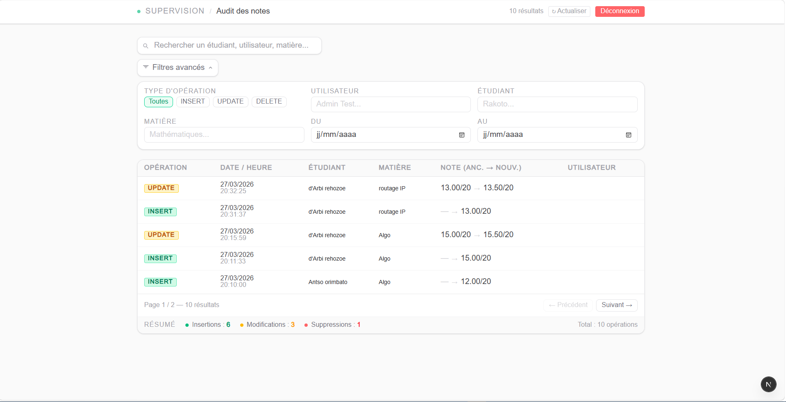

# 📊 Application de Gestion des Moyennes

## 📖 Overview

Application web fullstack permettant de gérer les notes des étudiants et de calculer automatiquement leurs moyennes grâce à l’utilisation de triggers PostgreSQL.

L’application dispose également d’une interface administrateur permettant de suivre et visualiser toutes les opérations effectuées dans le système (insertion, modification et suppression des données).

---

# 🚀 Features

## 👨‍🎓 User Interface
- Gestion des étudiants
- Ajout et modification des notes
- Calcul automatique des moyennes
- Interface responsive et intuitive

## 🛠️ Administration Dashboard
- Visualisation des opérations effectuées
- Historique des insertions
- Suivi des modifications
- Journalisation des suppressions

## ⚙️ Database Features
- Utilisation des triggers PostgreSQL
- Calcul automatique des moyennes
- API REST sécurisée

---

# 🧰 Tech Stack

| Layer | Technologies |
|-------|---------------|
| Frontend | Next.js, Tailwind CSS |
| Backend | Laravel (API REST) |
| Database | PostgreSQL |

---

# 🔗 Architecture

```text
Frontend (Next.js) → API Laravel → PostgreSQL
```

---

# 📦 Installation

## 🔧 Backend

```bash
cd backend
```

### Install dependencies

```bash
composer install
```

### Run backend server

```bash
php artisan serve
```

---

## 💻 Frontend

```bash
cd e-note-front
```

### Install dependencies

```bash
npm install
```

ou

```bash
yarn install
```

### Run frontend server

```bash
npm run dev
```

---

# 📸 Application Preview

<div align="center">

## 👨‍🎓 User Interface


<br><br>

## 🛠️ Admin Dashboard


</div>

---

# 📁 Project Structure

```bash
application-gestion-moyennes/
│
├── backend/
│   ├── app/
│   ├── routes/
│   ├── database/
│   └── ...
│
├── e-note-front/
│   ├── app/
│   ├── components/
│   └── ...
│
└── README.md
```
